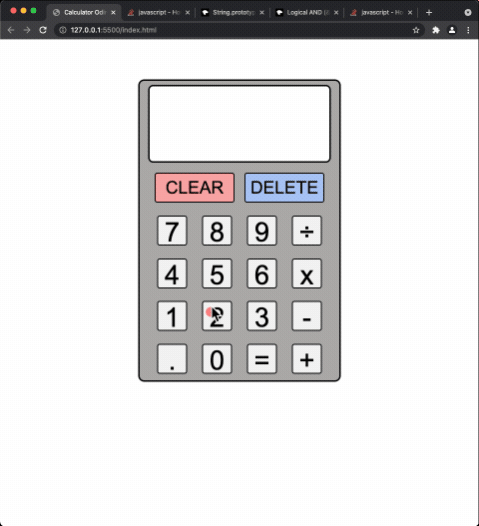

# Calculator

From [the Odin Project](http://www.theodinproject.com/courses/web-development-101/lessons/html-css)'s JS curriculum.

The project covers building basic javascript functions and DOM manipulation. 

[Live Demo](https://kamyar-mazloom.github.io/Calculator/) :point_left:

